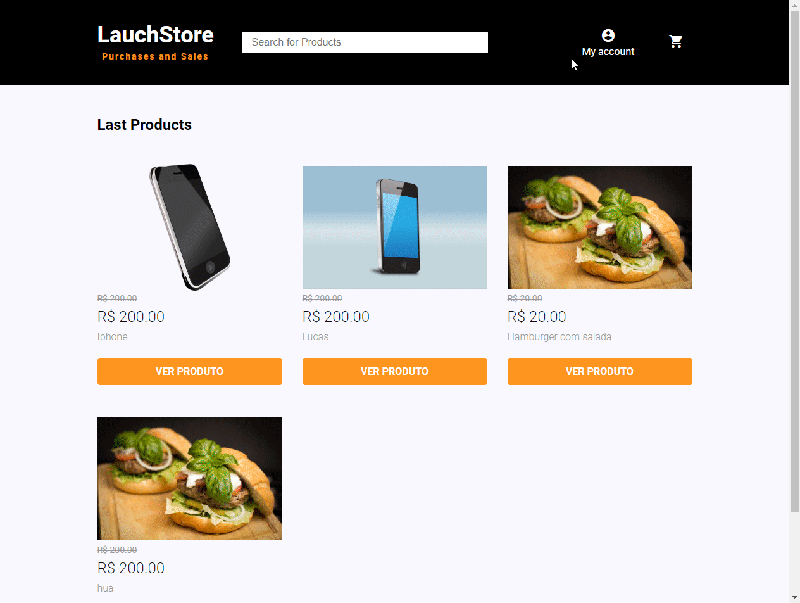

  
   

  <h1>Launchstore </h1>
   

Complete website for a recipes company called Foodfy.

 

  

 

  
  

## Features

- 💹 **Node Js** — A web framework for Node Js.
- 🛢️ **PostgresSql** — PostgreSQL is a powerful, open source object-relational database.
- 📕 **Html** — HTML is the standard markup language for Web pages.
- 📘 **CSS** — CSS is a language that describes the style of an HTML document.
- 💻 **JavaScript** — JavaScript is the programming language of HTML and the Web.

## Getting started

Describe here the way to use/install your project

1. Clone this repo using `https://github.com/Laerciosantosn/LauchBase-E-commerce-Launchstore.git`
2. Move yourself to the appropriate directory: `cd LauchBase-E-commerce-Launchstore` 
3. Run `code .` to open project in VsCode 

#### Getting started with the backend server

1. Run `npm install` to install the packages dependecies
2. In the `database.sql` file, copy and run the query in the databse 
3. Rename file `example.env` to `.env`
4. Configure the `.env` file with the Database and Mailer data.
5. Run the `seed.js` file to create date in your database.

#### Getting started with the frontend

1. Run `npm start` to start the web application
2. In your browser open `http://localhost:3000` to start the web application

## License

This project is licensed under the MIT License - see the [LICENSE](https://opensource.org/licenses/MIT) page for details.